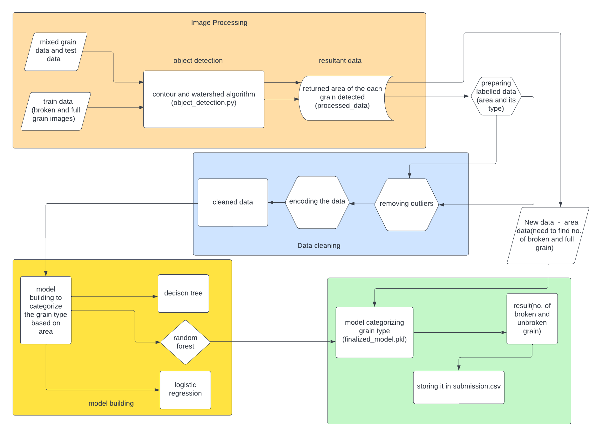
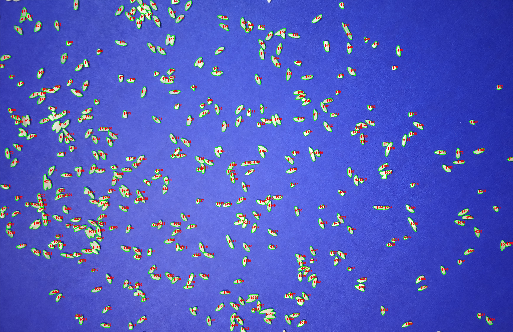

# Problem Statement
1. To identify rice in the given image (overlapping rice also included) and count the total , broken and full rice

# Approach
1. used watershed algorithm to detect rice from the image and to get the area .
2. using area ,build a ml algorithm to differentiate broken and full grain

# Repository detail
This repository contains a Python script that utilizes the contour and watershed algorithms to count the number of grains of rice in an image. The script is implemented using the OpenCV library.

The repository contains the following files:

1. object_detection.py: this script that performs the rice grain detection from the image
2. data: images with rice as data
3. requirements.txt: a list of dependencies needed to run the script just use pip install -r requirements.txt
4. test_area.json,train_area.json : it contains the output of the data_extraction
   1. it includes - total count
   2. area of each rice grain
   3. some statistics like avg area of rice per image ,median area of rice per image
5. data_extraction : 
   1. it utilizes the object_detection.py to detect rice grains and export the results to area.json
   2. it contains code to export data which is needed to train the machine learning model which will categorize broken and full grain
   3. data file exported by this code are stored in processed_data/object_detected_images,area_test,area_train,test_area,train_area
   4. area_test,area_train : contains area of the rice per image
   5. object_detected_images : contains image with count label(output of watershed algorithm)
6. model_building : contains code to build model which categorizes the rice and the best model is exported as finalized_model.pkl
7. counting : using the finalized_model.pkl we count each category of rice (broken or full) given the area
   1. output - count of broken, full , total rices
      1. data is stored in result 
8. submission.csv - contains the result of test images in the required format

# run the code in this order
1. data_extraction
2. model_building
3. counting 

# Result

## sample input of the image:

## sample output of the image:

# Count of rice:

1. total : 806
2. broken : 101
3. full : 302

# Usage:

1. Clone the repository to your local machine
2. Install the required dependencies using pip install -r requirements.txt
3. Run the Jupyter notebook sentiment_analysis.ipynb to train the sentiment analysis model
4. Tweak the parameters and models to get the best results for your needs