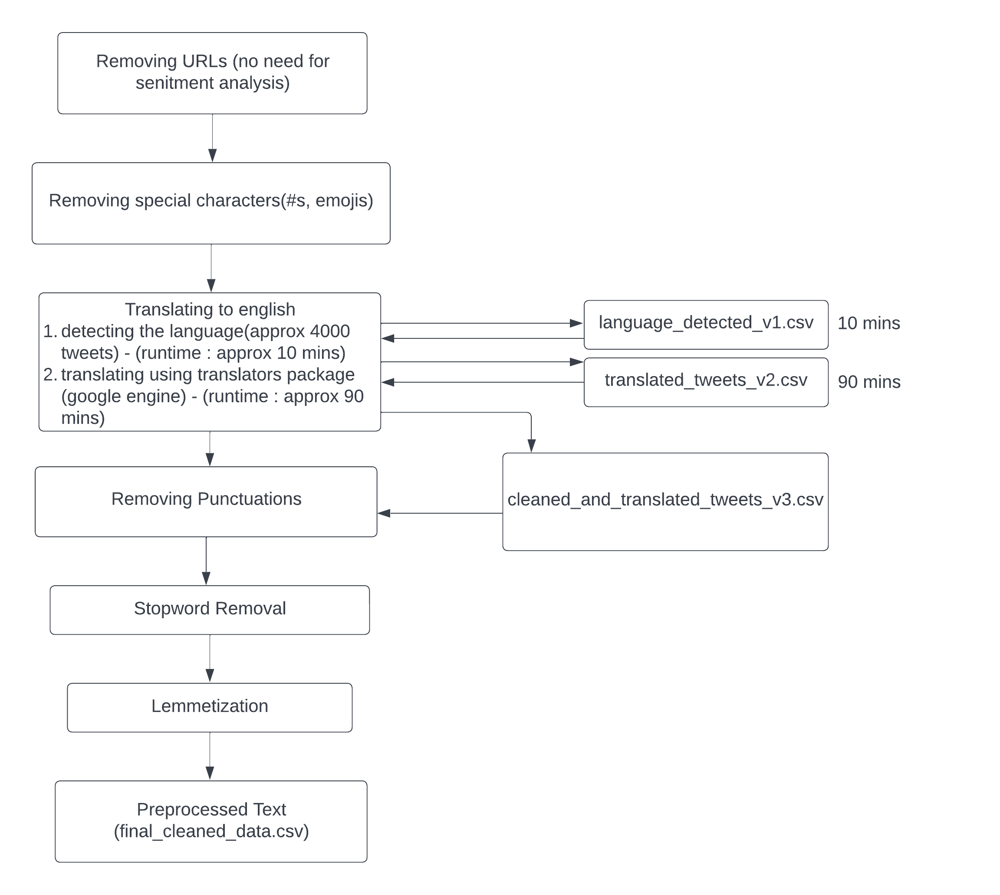
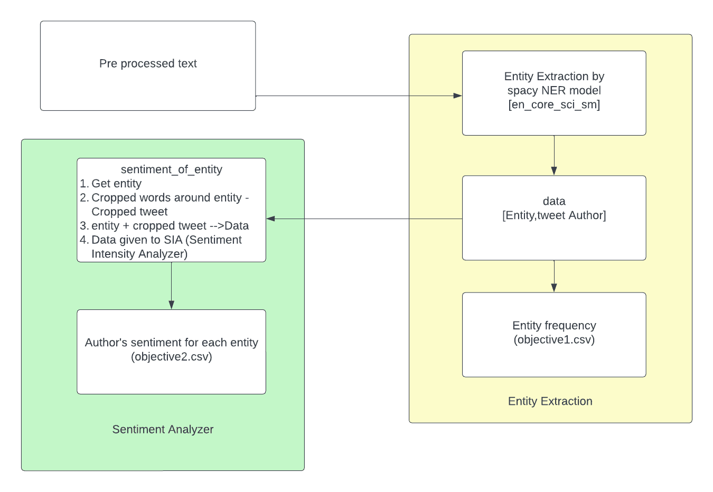

This repository contains a sentiment analysis model that is trained on tweets related to drugs and vaccines. The aim of this project is to understand the public sentiment towards these two topics on social media. The model is built using Python , spacy, nltk, vaderSentiment.

# Problem statement:
To understand the public sentiment towards drugs, vaccines ,health issues, progress on medical domain  on social media.

# Approach:
The sentiment analysis model uses SpaCy NER's en_core_sci_sm model to extract entities from tweets related to drugs and vaccines. Sentiment analysis is performed using SentimentIntensityAnalyzer (sia) from the nltk library. The tweets are collected from a online repository
#### TEXT PREPROCESSING PIPELINE

#### ENTITY SENTIMENT ANALYSIS MODEL

# File details:

1. Text_preprocessing_and_sentiment_analysis.ipynb - it contains code for text preprocessing ,entity extraction and sentiment analysis of that entity
   1. language_detected_v1.csv - contains detected languages of the tweets
   2. translated_tweets_v2.csv - contains translated tweets
   3. cleaned_and translated_tweets_v3.csv - contains updated tweets (translated tweets)
   4. final_cleaned_data.csv - contains data which has undergone all preprocessing step
2. en_core_sci_sm - contains spacy's NER model which is trained on scientific terms
3. tweets_and_entities.csv - contains processed data which will act as input for sentiment analysis model
4. result:
   1. objective1.csv - contains entity and its frequency
   2. objective2.csv - contains entity,author_name,sentiment(overall_polarity) for the entity 
5. process documentation - it contains step by step process of the model
6. requirement.txt - it contains all the dependencies
   

# Usage:

1. Clone the repository to your local machine
2. Install the required dependencies using pip install -r requirements.txt
3. Run the Jupyter notebook sentiment_analysis.ipynb to train the sentiment analysis model
4. Tweak the parameters and models to get the best results for your needs
5. while running Text_preprocessing_and_sentiment_analysis.ipynb language detection and translation will take 2 hrs at max to run so i commented that section. you can uncomment it if you would like